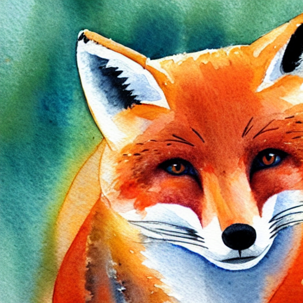

# Applied Stable Diffuion

## Components of Stable Diffusion Model

- VAE
- Tokenizer, Text Encoder
- UNet
- Scheduler

```python
# Load the autoencoder model which will be used to decode the latents into image space. 
vae = AutoencoderKL.from_pretrained("CompVis/stable-diffusion-v1-4", subfolder="vae")

# Load the tokenizer and text encoder to tokenize and encode the text. 
tokenizer = CLIPTokenizer.from_pretrained("openai/clip-vit-large-patch14")
text_encoder = CLIPTextModel.from_pretrained("openai/clip-vit-large-patch14")

# The UNet model for generating the latents.
unet = UNet2DConditionModel.from_pretrained("CompVis/stable-diffusion-v1-4", subfolder="unet")

# The noise scheduler
scheduler = LMSDiscreteScheduler(beta_start=0.00085, beta_end=0.012, beta_schedule="scaled_linear", num_train_timesteps=1000)

# To the GPU we go!
vae = vae.to(torch_device)
text_encoder = text_encoder.to(torch_device)
unet = unet.to(torch_device);
```

## Text Preperation

prompt = ["A watercolor painting of an otter"]

```python
text_input = tokenizer(prompt, padding="max_length", max_length=tokenizer.model_max_length, truncation=True, return_tensors="pt")
```

Tokenize edilmis text inputu inceleyelim

```python
text_input.keys()
# dict_keys(['input_ids', 'attention_mask'])

text_input['input_ids'].shape
# torch.Size([1, 77])

text_input['attention_mask']
# tensor([[1, 1, 1, 1, 1, 1, 1, 1, 0, 0, 0, 0, 0, 0, 0, 0, 0, 0, 0, 0, 0, 0, 0, 0, 0, 0, 0, 0, 0, 0, 0, 0, 0, 0, 0, 0, 0, 0, 0, 0, 0, 0, 0, 0, 0, 0, 0, 0, 0, 0, 0, 0, 0, 0, 0, 0, 0, 0, 0, 0, 0, 0, 0, 0, 0, 0, 0, 0, 0, 0, 0, 0, 0, 0, 0, 0, 0]])
```

Uncondition ve condition embeddingleri concat ediyoruz, Daha sonra bu bolum CFG icin kullanilacak.

```python
batch_size = 1

with torch.no_grad():
    text_embeddings = text_encoder(text_input.input_ids.to(torch_device))[0]
max_length = text_input.input_ids.shape[-1]
uncond_input = tokenizer(
    [""] * batch_size, padding="max_length", max_length=max_length, return_tensors="pt"
)

with torch.no_grad():
    uncond_embeddings = text_encoder(uncond_input.input_ids.to(torch_device))[0] 
text_embeddings = torch.cat([uncond_embeddings, text_embeddings])
```

Goruldugu gibi 77x768 boyutunde iki matrisimiz var.

```python
text_embeddings.shape
# torch.Size([2, 77, 768])
```

30 adim denoising yapacagimizi dusunelim.

```python
# Prep Scheduler
num_inference_steps = 30 # Number of denoising steps
scheduler.set_timesteps(num_inference_steps)
```

Latentlari olusturalim, stable diffusion 1.x modeli 512x512 boyutlu fotograflarla egitildi bu yuzden biz de genislik ve yuksekligi 512x512 olarak ayarliyoruz. Hatirlarsaniz unet modeli icin goruntu represantasyonlarini 4x64x64 boyutuna indirgeyecektik, bu yuzden latent matrislerimizdeki boyutu 8'e boluyoruz.

## Prep latents

```python

height = 512                        # default height of Stable Diffusion
width = 512                         # default width of Stable Diffusion
generator = torch.manual_seed(32)   # Seed generator to create the inital latent noise

latents = torch.randn(
  (batch_size, unet.in_channels, height // 8, width // 8),
  generator=generator,
)

latents = latents.to(torch_device)
latents = latents * scheduler.init_noise_sigma # Scaling (previous versions did latents = latents * self.scheduler.sigmas[0]

```

```python
latents.shape
# torch.Size([1, 4, 64, 64])
```

## Loop

```python
# Loop
with autocast("cuda"):
    for i, t in tqdm(enumerate(scheduler.timesteps)):
        # expand the latents if we are doing classifier-free guidance to avoid doing two forward passes.
        latent_model_input = torch.cat([latents] * 2)
        sigma = scheduler.sigmas[i]
        # Scale the latents (preconditioning):
        # latent_model_input = latent_model_input / ((sigma**2 + 1) ** 0.5) # Diffusers 0.3 and below
        latent_model_input = scheduler.scale_model_input(latent_model_input, t)

        # predict the noise residual
        with torch.no_grad():
            noise_pred = unet(latent_model_input, t, encoder_hidden_states=text_embeddings).sample

        # perform guidance
        noise_pred_uncond, noise_pred_text = noise_pred.chunk(2)
        noise_pred = noise_pred_uncond + guidance_scale * (noise_pred_text - noise_pred_uncond)

        # compute the previous noisy sample x_t -> x_t-1
        # latents = scheduler.step(noise_pred, i, latents)["prev_sample"] # Diffusers 0.3 and below
        latents = scheduler.step(noise_pred, t, latents).prev_sample

# scale and decode the image latents with vae
latents = 1 / 0.18215 * latents
with torch.no_grad():
    image = vae.decode(latents).sample
```

## Display

```python
image = (image / 2 + 0.5).clamp(0, 1)
image = image.detach().cpu().permute(0, 2, 3, 1).numpy()
images = (image * 255).round().astype("uint8")
pil_images = [Image.fromarray(image) for image in images]
pil_images[0]
```


