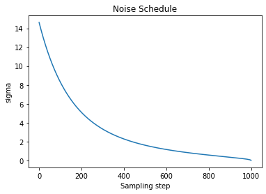
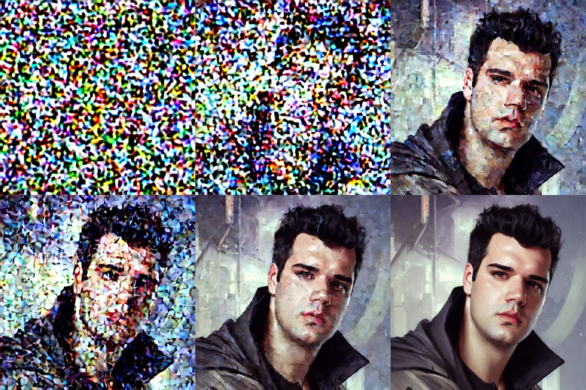

# Scheduler

Scheduler, sampler ayni anlamlarda kullaniliyor.

Diffusion prosesinde ana amacimiz fotografa yavas yavas gurultu eklemek ve her adimda modelin bu gurultuyu nasil kaldiracagini ogrenmesini beklemek. Modelin inference asamasinda verdigimiz random noise inputu kaldirarak goruntu olusturmasini istiyoruz. Goruntulere gurultu ekleme sureci lineer olmayan bir sekilde gerceklesiyor.

Noise Schedule, farklı zaman adımlarında ne kadar gürültü ekleneceğini beliyor. Scheduler orneklerinden birisi 'DDPM' ("Denoising Difüzyon Probabalistic Models") makalesini buradan okuyabilirsiniz.


Stable diffusion modeli icin bu noise ekleme sureci lineer olarak gerceklesmiyor, asagidaki gorselden gorebileceginiz gibi lineer bir gurultu ekleme sureci fotografin cok hizli bir sekilde pure noise formuna gecmesine sebebiyet veriyor bu yuzden, cosine kullaniyoruz.


Temel olarak schedule iki gorevden sorumludur:

- Goruntuye timestampler ile birlikte iterative olarak gurultu eklemek
- Fotograftaki gurultu kaldirilirken bir sonraki timestampde goruntunun nasil guncellenecegini belirlemek

## Uygulama

Scheduler'in nasil calistigina bakalim, egitim esnasinda 1000 step egittigimizi dusunelim.

```python
from diffusers import AutoencoderKL, LMSDiscreteScheduler, UNet2DConditionModel
import matplotlib.pyplot as plt

scheduler = LMSDiscreteScheduler(beta_start=0.00085, beta_end=0.012, beta_schedule="scaled_linear", num_train_timesteps=1000)

# Setting the number of sampling steps:
scheduler.set_timesteps(15)

# See these in terms of the original 1000 steps used for training:
print(scheduler.timesteps)
# tensor([999.0000, 927.6429, 856.2857, 784.9286, 713.5714, 642.2143, 570.8571,
#        499.5000, 428.1429, 356.7857, 285.4286, 214.0714, 142.7143,  71.3571,
#          0.0000], dtype=torch.float64)

# Look at the equivalent noise levels:
print(scheduler.sigmas)
# tensor([14.6146,  9.6826,  6.6780,  4.7746,  3.5221,  2.6666,  2.0606,  1.6156,
#         1.2768,  1.0097,  0.7913,  0.6056,  0.4397,  0.2780,  0.0292,  0.0000])
```

Sigma parametresi goruntunun latent representasyonuna ne kadar gurultu eklendigini gosteriyor.

```python
# Plotting this noise schedule:
plt.plot(scheduler.sigmas)
plt.title('Noise Schedule')
plt.xlabel('Sampling step')
plt.ylabel('sigma')
plt.show()
```



## Gurultu Eklemek

Gorselmimize gurultu eklemenin nasil oldugunu gorsellestirelim.
Autoencoder adiminda gorselimizin VAE'den gectikten sonraki encoded halini yani latent representationini cikartmistik.

```python
noise = torch.randn_like(encoded) # Random noise
sampling_step = 10 # Equivalent to step 10 out of 15 in the schedule above
# encoded_and_noised = scheduler.add_noise(encoded, noise, timestep) # Diffusers 0.3 and below
encoded_and_noised = scheduler.add_noise(encoded, noise, timesteps=torch.tensor([scheduler.timesteps[sampling_step]]))
latents_to_pil(encoded_and_noised.float())[0] # Display
```

### Sampling steps: [0, 10, 20, 25, 27, 29]



## Scheduler Tipleri

| Name  | Definition |
|------------------------|--------------------------------------------------------------------------------|
| ddim  | Denoising Diffusion Implicit Models |
| ddpm  | Denoising Diffusion Probabilistic Models     |
| singlestep_dpm_solver  | Singlestep DPM-Solver       |
| multistep_dpm_solver   | Multistep DPM-Solver        |
| heun  | Heun scheduler inspired by Karras et. al paper       |
| dpm_discrete  | DPM Discrete Scheduler inspired by Karras et. al paper        |
| dpm_discrete_ancestral | DPM Discrete Scheduler with ancestral sampling inspired by Karras et. al paper |
| stochastic_karras_ve   | Variance exploding, stochastic sampling from Karras et. al    |
| lms_discrete  | Linear multistep scheduler for discrete beta schedules        |
| pndm  | Pseudo numerical methods for diffusion models (PNDM) |
| score_sde_ve  | variance exploding stochastic differential equation (VE-SDE) scheduler|
| ipndm | improved pseudo numerical methods for diffusion models (iPNDM)|
| score_sde_vp  | Variance preserving stochastic differential equation (VP-SDE) scheduler        |
| euler | Euler scheduler    |
| euler_ancestral        | Euler Ancestral scheduler   |
| vq_diffusion  | VQDiffusionScheduler        |
| repaint       | RePaint scheduler  |

## Lessons Learned Schedulers

There are ancestral samplers (marked by the letter "a") whose output will keep changing as the number of steps increases, and the others, which will eventually settle on a final image. This final image is different between Karras and non-Karras samplers, but very similar within those groups.

Then there's DPM fast, which doesn't feel particularly fast, and which always seems to produce inferior images for me.

DPM adaptive is also its own thing, as it ignores step count and works with cfg scale instead. More cfg = more steps. I kind of like it when I'm not sure how many steps I should use, but the final step count is generally high. It can also take a long, long time if you use the "AND" prompt syntax - I have interrupted it after waiting for over 2000 steps.

Most differences between the different samplers appear at low step counts < 20. Some produce distinguishable images faster and some slower, and may look very different in the early stages. That's random though, there's no good way to predict what those early images will turn into with more steps.

In practice, the choice of samplers is just preference, there's actually very little difference in the long run.

First, you have to understand what samplers are. These are discretized differential equations. I'm not going to go into these at all in this post, but I've covered them before.

DDIM and PLMS were the original samplers. They were part of Latent Diffusion's repository. They stand for the papers that introduced them, Denoising Diffusion Implicit Models and Pseudo Numerical Methods for Diffusion Models on Manifolds.

Almost all other samplers come from work done by @RiversHaveWings or Katherine Crowson, which is mostly contained in her work at this repository. She is listed as the principal researcher at Stability AI. Her notes for those samplers are as follows:

⁠Euler - Implements Algorithm 2 (Euler steps) from Karras et al. (2022)
⁠Euler_a - Ancestral sampling with Euler method steps.
⁠LMS - No information, but can be inferred that the name comes from linear multistep coefficients
⁠Heun - Implements Algorithm 2 (Heun steps) from Karras et al. (2022).
⁠DPM2 - A sampler inspired by DPM-Solver-2 and Algorithm 2 from Karras et al. (2022).
⁠DPM2 a - Ancestral sampling with DPM-Solver second-order steps
⁠DPM++ 2s a - Ancestral sampling with DPM-Solver++(2S) second-order steps
⁠DPM++ 2M - DPM-Solver++(2M)
⁠DPM++ SDE - DPM-Solver++ (stochastic)
⁠DPM fast - DPM-Solver-Fast (fixed step size). See <https://arxiv.org/abs/2206.00927>
⁠DPM adaptive - DPM-Solver-12 and 23 (adaptive step size). See <https://arxiv.org/abs/2206.00927>
The 'Karras' versions of these weren't made by Karras as far as I can tell, but instead are using a variance-exploding scheduler from the Karras paper, which of course is extra confusing given that most of the other samplers were inspired by that paper in the first place.

In terms of "what will I get at high step counts", most of the time you will get similar pictures from:

⁠Group A: Euler_a, DPM2 a, DPM++ 2S a, DPM fast (after many steps), DPM adaptive, DPM2 a Karras
⁠Group B: Euler, LMS, Heun, DPM2, DPM++ 2M, DDIM, PLMS
⁠Group C: LMS Karras, DPM2 Karras, DPM++ 2M Karras
As far as convergence behavior:

⁠Does not converge: Euler_a, DPM2 a, DPM Fast, DDIM, PLMS, DPM adaptive, DPM2 a Karras
⁠Converges: Euler, LMS, Heun, DPM2, DPM++ 2M, LMS Karras, DPM2 Karras, DPM++ 2M Karras
By required steps:

⁠Euler_a = Euler = DPM++2M = LMS Karras (image degraded at high steps) >
⁠LMS = DPM++ 2M Karras = Heun (slower) = DPM++ 2S a (slower) = DPM++ 2S a Karras >
⁠DDIM = PLMS = DPM2 (slower) = DPM 2 Karras>
⁠DPM Fast = DPM2 a (slower)
These all give somewhat different results so a person could prefer the output of any of the models at a given CFG or step range. I do think that there is an argument to be made that DPM++ 2M and Euler_a are good generic samplers for most people, however, as they both resolve to a good picture at low seeds (sub-20) without a hit to iteration speed. DPM++ 2M has the advantage of converging to a single image more often (if you choose to run the same image at higher seed), but is slightly more prone to deformations at high CFG.

To combine all the above:

⁠Fast, new, converges: DPM++ 2M, DPM++ 2M Karras
⁠Fast, doesn't converge: Euler_a, DPM2 a Karras
⁠Others worth considering: DPM2 a, LMS, DPM++ 2S a Karras
⁠Bugged: LMS Karras (at high steps
⁠Older, fast but maybe lower quality final result: Euler, LMS, Heun
⁠Slow: DDIM, PLMS, DPM2, DPM 2 Karras, DPM Fast, DPM2 a
TL;DR

These are confusingly named and mostly come from academic papers. The actual mechanisms of each sampler aren't really relevant to their outputs. In general PLMS, DDIM, or DPM fast are slower and give worse results.

Instead, try out DPM++ 2M and Euler_a, along with DPM++ 2M Karras. These should all give good results at a low seed value.
