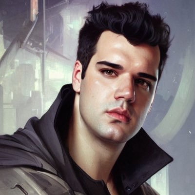

# Autoencoder in Stable Diffusion

```python
def pil_to_latent(input_im):
    # Single image -> single latent in a batch (so size 1, 4, 64, 64)
    with torch.no_grad():
        latent = vae.encode(tfms.ToTensor()(input_im).unsqueeze(0).to(torch_device)*2-1) # Note scaling
    return 0.18215 * latent.latent_dist.sample()

def latents_to_pil(latents):
    # bath of latents -> list of images
    latents = (1 / 0.18215) * latents
    with torch.no_grad():
        image = vae.decode(latents).sample
    image = (image / 2 + 0.5).clamp(0, 1)
    image = image.detach().cpu().permute(0, 2, 3, 1).numpy()
    images = (image * 255).round().astype("uint8")
    pil_images = [Image.fromarray(image) for image in images]
    return pil_images
```

```python
# Load the image with PIL
input_image = Image.open('cobanov.jpg').resize((512, 512))
input_image
```



```python
# Encode to the latent space
encoded = pil_to_latent(input_image)
encoded.shape
```

```python
# Let's visualize the four channels of this latent representation:
fig, axs = plt.subplots(1, 4, figsize=(16, 4))
for c in range(4):
    axs[c].imshow(encoded[0][c].cpu(), cmap='viridis')
```


```python
# Decode this latent representation back into an image
decoded = latents_to_pil(encoded)[0]
decoded
```

Gozlerde ve burun altinda ufak bozulmalar mevcut fakat genel olarak VAE oldukca iyi bir performans gostererek fotografi tekrardan olusturmayi basardi.


Sonuclar oldukca iyi 3x512x512 boyutunda bir fotografi 4x64x64 boyutuna indirgedik ve neredeyse kayipsiz bir sekilde geri getirmeyi basardik. Bu 48 katlik sikistirma anlamina geliyor.

```text
Orijinal Gorsel:            3x512x512 = 786432 
Latent Representasyonu:     4 x 64 x 64 = 16384
Scale Factor:               786432 / 16384 = 48
```

Daha yuksek sikistirma oranlarina sahip AE modelleri de gorebilirsiniz, VQGAN'daki fp16 gibi fakat gunun sonunda fotografta daha fazla artifakt goreceksiniz.

Peki neden AE kullaniyoruz biraz bunu konusalim. Eger fotograflarini oldugu gibi diffusion modelinde egitime sokarsaniz, bu cok fazla islem yapmaniza sebebiyet verecek, 786.432 pikselde islem yapmak yerine 16.384 piksel islem yapmak oldukca verimli, goruldugu gibi fotograf uzerinde de kaybimiz neredeyse minimum seviyede.

Bazi modeller diffusion prosesini 64x64 boyutunda yapip daha sonrasinda goruntuyu upscale etmeye calisiyor, bu da cozumlerden biri, fakat bu cok kucuk bir gorseli defalarca upscale etmek anlamina geliyor, bunun icin ayri bir upscaling modeli de egitmeniz gerekiyor. Bunun yerine latent diffusion bu islemi gercek goruntuler yerine VAE'den altigi latent space'de yapiyor. Bu latent space bilgi anlaminda oldukca zengin ve fotografi tekrardan olusturmak icin yeterli bilgiyi icerdigi icin diffusion prosesine iyi bir optimizasyon sagliyor.
