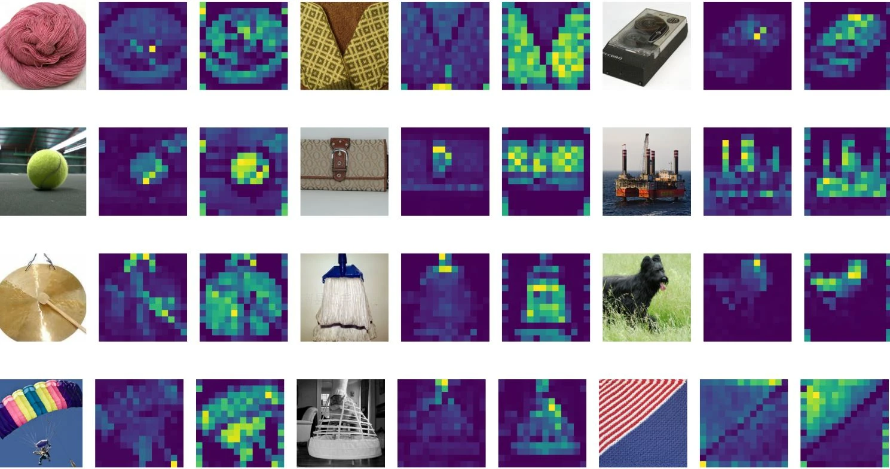
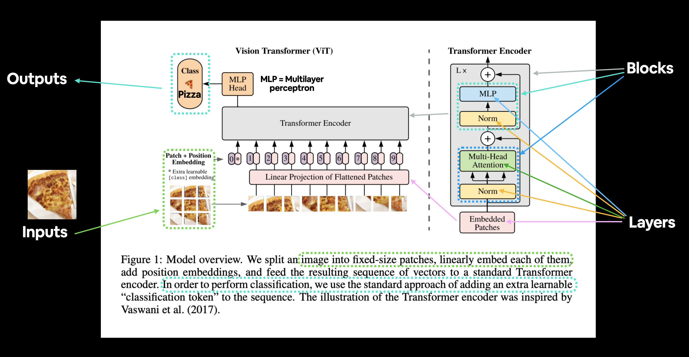
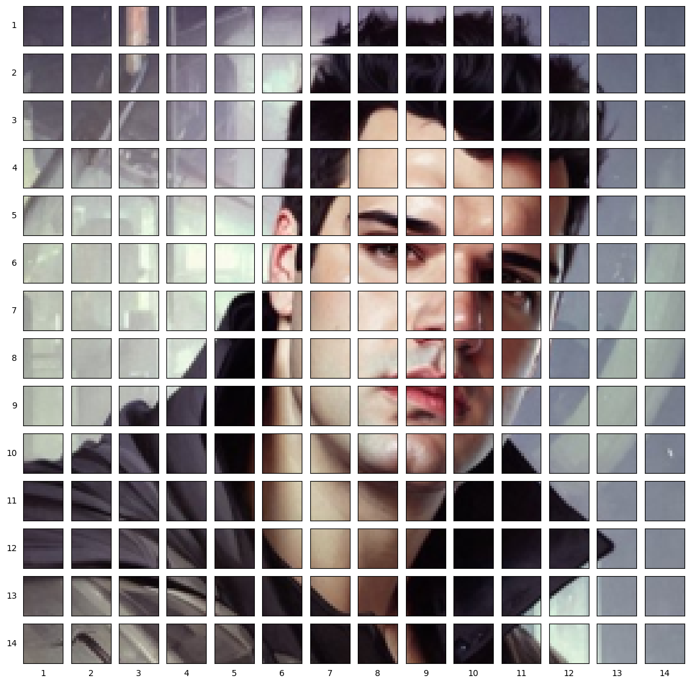
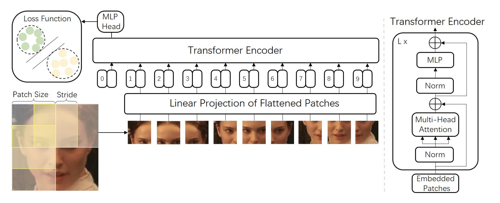
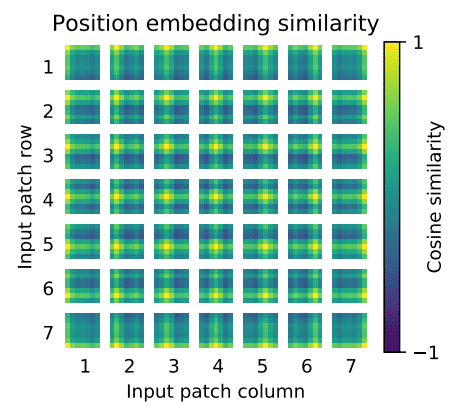

# Vision Transformers ViTs

## Introduction

2022 yili yapay zekanin yili oldu, yapay zeka sanatinda, dogal dil islemede, goruntu islemede, ses teknolojilerinde inanilmaz gelismeler yasandi. Hem [Huggingface](https://huggingface.co/) hem [OpenAI](https://openai.com/) firtinalar kopardi. Onceki yillara nazaran bu yapay zeka teknolojileri hem demokratiklesti hem de son kullaniciya daha fazla ulasma firsati buldu.

Bugun sizinle bu gelismelerden biri olan Vision Transformerlardan bahsedecegim. Makale giderek derinlesip tekniklesiyor, bu yuzden tum akisi basitten karmasiga olacak sekilde siraladim. Bu konu ne kadar ilginizi cekiyorsa o kadar ileri gidebilirsiniz.

`Bu makaleyi yazarken bircok kaynaktan, bloglardan, kendi bilgilerimden hatta ChatGPT'den dahi yararlandim. Daha derin okumalar yapmak isterseniz lutfen kaynaklar bolumune goz atin!`

### TL; DR

2022'de Vision Transformer (ViT), şu anda bilgisayar görüşünde son teknoloji olan ve bu nedenle farklı görüntü tanıma görevlerinde yaygın olarak kullanılan evrişimli sinir ağlarına (CNN'ler) rekabetçi bir alternatif olarak ortaya çıktı.

ViT modelleri, hesaplama verimliliği ve doğruluğu açısından mevcut en son teknolojiye (CNN) neredeyse 4 kat daha iyi performans gösteriyor.

Bu makale aşağıdaki konulardan bahsedecegim:

- Vision Transformer (ViT) nedir?
- Vision Transformers vs Convolutional Neural Networks
- Attention Mekanizmasi
- ViT Implementasyonlari
- ViT Mimarisi
- Vision Transformers'ın Kullanım ve Uygulamasi

## Vision Transformers


Uzun yillardir CNN algoritmalari goruntu isleme konularinda neredeyse tek cozumumuzdu. [ResNet](https://arxiv.org/abs/1512.03385), [EfficientNet](https://arxiv.org/abs/1905.11946), [Inception](https://arxiv.org/abs/1512.00567) vb. gibi tum mimariler temelde CNN mimarilerini kullanarak goruntu isleme problemlerimizi cozmede bize yardimci oluyordu. Bugun sizinle goruntu isleme konusunda farkli bir yaklasim olan ViT'ler yani Vision Transformerlari inceleyecegiz.

Aslinda Transformer kavrami NLP alaninda yurutulen teknolojiler icin ortaya kondu. [Attention Is All You Need](https://arxiv.org/abs/1706.03762) adiyla yayinlanan makale NLP problemlerinin cozumu icin devrimsel cozumler getirdi, artik Transformer-based mimarilar NLP gorevleri icin standart bir hale geldi.

Cok da uzun bir sure gecmeden dogal dil alaninda kullanilan bu mimari goruntu alaninda da ufak degisikliklerle uyarlandi. Bu calismayi [An image is worth 16x16 words](https://arxiv.org/abs/2010.11929) olarak bu linkteki paperdan okuyabilirsiniz.

Asagida daha detayli anlatacagim fakat surec temel olarak bir goruntuyu 16x16 boyutlu parcalara ayirarak embeddinglerini cikartmak uzerine calisiyor. Temel bazi konulari anlatmadan bu mekanikleri aciklamak cok zor bu yuzden hiz kaybetmeden konuyu daha iyi anlamak icin alt basliklara gecelim.

## ViTs vs. CNN

Bu iki mimariyi karsilastirdigimizda acik ara ViTlerin cok daha etkileyici oldugunu gorebiliyoruz.

Vision Transformerlar, training için daha az hesaplama kaynağı kullanirken ayni zamanda, evrişimli sinir ağlarına (CNN) daha iyi performans gosteriyor.

Birazdan asagida daha detayli olarak anlatacagim fakat temelde CNN'ler piksel dizilerini kullanır, ViT ise görüntüleri sabit boyutlu ufak parcalara boler. Her bir parca transformer encoder ile patch, positional vs. embeddingleri cikartilir (asagida anlatacagim konular bunlari iceriyor). Ayrıca ViT modelleri, hesaplama verimliliği ve doğruluğu söz konusu olduğunda CNN'lerden neredeyse dört kat daha iyi performans gösteriyorlar.

ViT'deki self-attention katmanı, bilgilerin genel olarak görüntünün tamamına yerleştirilmesini mümkün kiliyor bu demek oluyor ki yeniden birlestirmek istedigimizde veya yenilerini olusturmak istedigimizde bu bilgi de elimizde olacak, yani modele bunlari da ogretiyoruz.



*Raw gorselleri (solda)  ViT-S/16 modeliyle attention haritalari (sagda)*

Kaynak:  *When Vision Transformers Outperform ResNets without Pre-training or Strong Data Augmentations* <https://arxiv.org/abs/2106.01548>

## Attention Mekanizmasi

`Bu bolum ChatGPT ile yazildi`

Özetle, NLP (Doğal Dil İşleme) için geliştirilen attention(dikkat) mekanizmaları, yapay sinir ağı modellerinin girdiyi daha iyi işleyip anlamasına yardımcı olmak için kullanılır. Bu mekanizmalar, girdinin farklı bölümlerine farklı ağırlık verilerek çalışır, bu sayede model girdiyi işlerken belli bölümlere daha fazla dikkat eder.

Attention mekanizmaları, dot-product attention, multi-head attention ve transformer attention gibi farklı türleri geliştirilmiştir. Bu mekanizmalar her birisi biraz farklı şekilde çalışsa da, hepsi girdinin farklı bölümlerine farklı ağırlık verilerek modelin belli bölümlere daha fazla dikkat etmesine izin verme ilkesi üzerine çalışır.

Örneğin, bir makine çeviri görevinde, bir attention mekanizması modelin kaynak dil cümlesindeki belli kelimeleri üreterek hedef dil cümlesine dikkat etmesine izin verebilir. Bu, modelin daha doğru çeviriler üretebilmesine yardımcı olur, çünkü kaynak dil kelimelerinin anlam ve bağlamını dikkate alarak çeviri üretebilir.

Genel olarak, attention mekanizmaları birçok state-of-the-art NLP modelinin bir parçasıdır ve bu modellerin çeşitli görevlerde performansını geliştirme konusunda çok etkili olduğu gösterilmiştir.

`ChatGPT sonu`

Aslinda konuya hakim biri icin daha iyi bir aciklama fakat cok kisa bu alanda hicbir bilgisi olmayan birisi icin basitlestirilmis bir aciklama burada harika bir sekilde anlatilmis

[Mechanics of Seq2seq Models With Attention](https://jalammar.github.io/visualizing-neural-machine-translation-mechanics-of-seq2seq-models-with-attention/)

[Illustrated Transformer](https://jalammar.github.io/illustrated-transformer/)

## ViT Implementasyonlari

Fine-tune edilmis ve pre-trained  ViT modelleri [Google Research](https://github.com/google-research/)'un Github'ında mevcut:

<https://github.com/google-research/vision_transformer>

Pytorch Implementasyonlari lucidrains'in Github reposunda bulabilirsiniz:

<https://github.com/lucidrains/vit-pytorch>

Ayni zamanda `timm` kullanarak hazir modelleri hizlica kullanabilirsiniz.

<https://github.com/rwightman/pytorch-image-models>

## Mimari

ViT mimarisi birkaç aşamadan oluşuyor:

1. **Patch + Position Embedding (inputs)** - Giriş görüntüsünü bir dizi görüntü parcalarina (patches) dönüştürür ve parcalarin hangi sırayla geldiğini bilmek icin bir konum numarası ekler.

2. **Linear projection of flattened patches (Embedded Patches)** - Görüntü parcalari embeddinglere donusturulur, görüntüleri direkt kullanmak yerine embeddingleri kullanmanın yararı, embeddingler görüntünün eğitimle öğrenilebilir bir temsili olmasıdır.

3. **Norm** - Bir sinir ağını düzenli hale getirmek (overfitting'i azaltmak) için bir teknik olan "Layer Normalization" veya "LayerNorm"un kısaltmasıdır.

4. **Multi-Head Attention** - Bu, Multi-Headed Self-Attention layer veya kısaca "MSA" dır.

5. **MLP (Multilayer perceptron)** - Genellikle herhangi bir feed-forward (ileri besleme) katmanı koleksiyonu olarak dusunebilirsiniz.

6. **Transformer Encoder** - Transformer Encoder, yukarıda listelenen katmanların bir koleksiyonudur. Transformer Encoderin içinde iki skip (atlama) bağlantısı vardır ("+" sembolleri), katmanın girdilerinin doğrudan sonraki katmanların yanı sıra hemen sonraki katmanlara beslendiği anlamına gelir. Genel ViT mimarisi, birbiri üzerine yığılmış bir dizi Transformer kodlayıcıdan oluşur.

7. **MLP Head** - Bu, mimarinin çıktı katmanıdır, bir girdinin öğrenilen özelliklerini bir sınıf çıktısına dönüştürür. Görüntü sınıflandırması üzerinde çalıştığımız için buna "sınıflandırıcı kafa" da diyebilirsiniz. MLP head yapısı MLP bloğuna benzer.

## ViT Mimarisi



### Patch Embeddings

Standart Transformer, girişi tek boyutlu token embedding dizisi olarak alır. 2B görüntüleri işlemek için **x∈R^{H×W×C}** görüntüsünü düzleştirilmiş 2B patchlere (goruntu parcalarina) yeniden şekillendiriyoruz.

Burada, (H, W) orijinal görüntünün çözünürlüğüdür ve (P, P) her görüntü parçasının çözünürlüğüdür. Resim sabit boyutlu parcalara bölünmüştür, aşağıdaki resimde patch  (parca) boyutu 16×16 olarak alınmıştır. Yani görüntünün boyutları 48×48 olacaktır. (Cunku 3 kanal var)

Self-attention maliyeti quadratictir. Görüntünün her pikselini girdi olarak iletirsek, Self-attention her pikselin diğer tüm piksellerle ilgilenmesini gerektirir. Self-attention ikinci dereceden maliyeti çok maliyetli olacak ve gerçekçi girdi boyutuna ölçeklenmeyecek; bu nedenle, görüntü parcalara bölünür.

Yani sair burada her pikselle ugrasmak sonsuza kadar surecegi icin 16x16 boyutlu goruntu bolumlerinin embeddinglerini almanin parametre sayisini dusureceginden bahsediyor.

```python
import matplotlib.pyplot as plt
from PIL import Image
import numpy as np
```

```python
img = Image.open('cobanov-profile.jpg')
img.thumbnail((224, 224))
array_img = np.array(img)
array_img.shape
```

```python
# Setup hyperparameters and make sure img_size and patch_size are compatible
img_size = 224
patch_size = 16
num_patches = img_size/patch_size 
assert img_size % patch_size == 0, "Image size must be divisible by patch size" 
print(f"Number of patches per row: {num_patches}\
        \nNumber of patches per column: {num_patches}\
        \nTotal patches: {num_patches*num_patches}\
        \nPatch size: {patch_size} pixels x {patch_size} pixels")

```

```python
# Create a series of subplots
fig, axs = plt.subplots(nrows=img_size // patch_size, # need int not float
                        ncols=img_size // patch_size, 
                        figsize=(num_patches, num_patches),
                        sharex=True,
                        sharey=True)

# Loop through height and width of image
for i, patch_height in enumerate(range(0, img_size, patch_size)): # iterate through height
    for j, patch_width in enumerate(range(0, img_size, patch_size)): # iterate through width

        # Plot the permuted image patch (image_permuted -> (Height, Width, Color Channels))
        axs[i, j].imshow(array_img[patch_height:patch_height+patch_size, # iterate through height 
                                        patch_width:patch_width+patch_size, # iterate through width
                                        :]) # get all color channels

        # Set up label information, remove the ticks for clarity and set labels to outside
        axs[i, j].set_ylabel(i+1, 
                             rotation="horizontal", 
                             horizontalalignment="right", 
                             verticalalignment="center") 
        axs[i, j].set_xlabel(j+1) 
        axs[i, j].set_xticks([])
        axs[i, j].set_yticks([])
        axs[i, j].label_outer()

# Set a super title
plt.show()
```



## Linear Projection of Flattened Patches

Parcalari Transformer bloğuna geçirmeden önce, makalenin yazarları yamaları önce doğrusal bir projeksiyondan geçirmeyi faydalı bulmuslar. Bir yamayı alıp büyük bir vektöre açarlar ve patch embeddingler (goruntu parcalarinin gommeleri? veya embedddingleri) oluşturmak için embedding matrisiyle çarparlar ve bu konumsal gömmeyle (positional embeddings) birlikte transformatöre giden şeydir.

Her goruntu parcasi (patches), tüm piksel kanallarını bir yamada birleştirerek ve ardından bunu doğrusal olarak istenen giriş boyutuna yansıtarak embed edilen bir 1B patch'e düzleştirilir.

Ne demek istedigimi bu gorselde cok daha iyi anlayacaginizi dusunuyorum.


*Kaynak: [Face Transformer for Recognition](https://arxiv.org/pdf/2103.14803.pdf)*

## Positional embeddings

Nasil konusurken dilde kelimelerin sırası kurdugunuz cumlenin anlamini tamamen degistiriyorsa, goruntuler uzerinde de buna dikkat etmek gerekiyor. Maalesef transformerlar, patch embeddinglerin "sırasını" dikkate alan herhangi bir varsayılan mekanizmaya sahip değiller.

Bir yapboz yaptiginizi dusunun, elinizdeki parcalar (yani onceki adimlarda yaptigimiz patch embeddingler) karisik bir duzende geldiginde goruntunun tamaminda ne oldugunu anlamak oldukca zordur, bu transformerlar için de geçerli. Modelin yapboz parçalarının sırasını veya konumunu çıkarmasını sağlamanın bir yoluna ihtiyacımız var.

Transformerlar, giriş elemanlarının yapısından bağımsızdır. Her yamaya öğrenilebilir positional embeddings (konum yerleştirmeleri) eklemek, modelin görüntünün yapısı hakkında bilgi edinmesine olanak tanır.

Positional embeddingler de, bu düzeni modele aktarmamizi sagliyor. ViT için, bu positional embeddingler, patch embeddingler ile aynı boyutluluğa sahip öğrenilmiş vektörlerdir.

Bu positional embeddingler, eğitim sırasında ve (bazen) ince ayar sırasında öğrenilir. Eğitim sırasında, bu embeddingler, özellikle aynı sütunu ve satırı paylaşan komşu konum yerleştirmelerine yüksek benzerlik gösterdikleri vektör uzaylarında birleşir.



## Transformer Encoding

- **Multi-Head Self Attention Layer(MSP)** birden fazla attention ciktisini lineer olarak beklenen boyutlara esitlemek için kullanilir. MSP, görüntüdeki yerel ve global bağımlılıkları öğrenmeye yardımcı olur.

- **Multi-Layer Perceptrons(MLP)** - Klasik sinir agi katmani fakat aktivasyon fonksiyonu olarak GELU [Gaussian Error Linear Units](https://arxiv.org/abs/1606.08415) kullaniyoruz.

- **Layer Norm(LN)** eğitim görüntüleri arasında herhangi bir yeni bağımlılık getirmediğinden her bloktan önce uygulanır. Eğitim süresini ve genelleme performansını iyileştirmeye yardımcı olur. Burada Misra'nin harika bir [videosu](https://www.youtube.com/watch?v=2V3Uduw1zwQ&ab_channel=AssemblyAI) var. Bu da [Paper](https://arxiv.org/abs/1607.06450).

- **Residual connections** gradyanların doğrusal olmayan aktivasyonlardan geçmeden doğrudan ağ üzerinden akmasına izin verdiği için her bloktan sonra uygulanır.
Image classification için, ön eğitim zamanında bir hidden layer ve fine-tuning için tek bir linear layer ile MLP kullanılarak bir classification head uygulanır. ViT'nin üst katmanları global özellikleri öğrenirken, alt katmanlar hem global hem de yerel özellikleri öğrenir. Bu da aslinda ViT'nin daha genel kalıpları öğrenmesini sagliyor.

## Toparlama

Evet oldukca fazla terim, teori ve mimari inceledik kafalarda daha iyi oturtmak adina bu gif surecin nasil isledigini guzel bir sekilde ozetliyor.


## Usage

Eger basitce bir ViT kullanmak isterseniz bunun icin ufacik bir rehberi de buraya ekliyorum.

Muhtemelen denk gelmissinizdir artik yapay zeka alaninda yeni bir sey ciktiginda birakin bunun implementasyonunu kullanimini da birkac satir koda indirmek moda oldu.

Yukarida anlattigim her seyi birkac satir Python koduyla nasil yapildigina bakalim.

Colab linki: <https://colab.research.google.com/drive/1sPafxIo6s1BBjHbl9e0b_DYGlb2AMBC3?usp=sharing>

Oncelikle pretrained model instantiate *(orneklendirmek?)* edelim.

```python
import timm

model = timm.create_model('vit_base_patch16_224', pretrained=True)
model.eval()
```

Goruntumuzu yukleyip on islemelerini tamamlayim. Ben burada twitter profil fotograimi kullanacagim.


```python
# eger kendiniz bir gorsel vermek isterseniz 
# asagidaki kodda bu kismi comment'e alip, 
# filename kismina local path verebilirsiniz.

url, filename = ("https://github.com/pytorch/hub/raw/master/images/dog.jpg", "dog.jpg")
urllib.request.urlretrieve(url, filename)
```

```python
import urllib
from PIL import Image
from timm.data import resolve_data_config
from timm.data.transforms_factory import create_transform

config = resolve_data_config({}, model=model)
transform = create_transform(**config)

url, filename = ("https://pbs.twimg.com/profile_images/1594739904642154497/-7kZ3Sf3_400x400.jpg", "mert.jpg")
urllib.request.urlretrieve(url, filename)
img = Image.open(filename).convert('RGB')
tensor = transform(img).unsqueeze(0) # transform and add batch dimension

```

Tahminleri alalim

```python
import torch

with torch.no_grad():
    out = model(tensor)
probabilities = torch.nn.functional.softmax(out[0], dim=0)
print(probabilities.shape)

# prints: torch.Size([1000])
```

En populer 5 tahminin siniflarina bakalim.

```python
# Get imagenet class mappings
url, filename = ("https://raw.githubusercontent.com/pytorch/hub/master/imagenet_classes.txt", "imagenet_classes.txt")
urllib.request.urlretrieve(url, filename) 
with open("imagenet_classes.txt", "r") as f:
    categories = [s.strip() for s in f.readlines()]

# Print top categories per image
top5_prob, top5_catid = torch.topk(probabilities, 5)
for i in range(top5_prob.size(0)):
    print(categories[top5_catid[i]], top5_prob[i].item())
```

```python
trench coat             0.422695130109787
bulletproof vest        0.18995067477226257
suit                    0.06873432546854019
sunglasses              0.02222270704805851
sunglass                0.020680639892816544
```

## Sources

- <https://www.learnpytorch.io/08_pytorch_paper_replicating/#3-replicating-the-vit-paper-an-overview>
- <https://theaisummer.com/vision-transformer/>
- <https://medium.com/swlh/visual-transformers-a-new-computer-vision-paradigm-aa78c2a2ccf2>
- <https://viso.ai/deep-learning/vision-transformer-vit/>
- <https://arxiv.org/abs/2106.01548>
